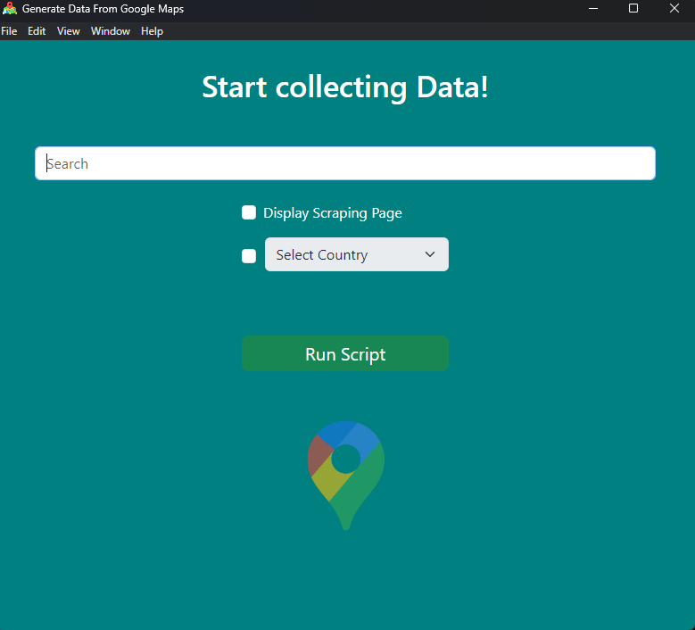
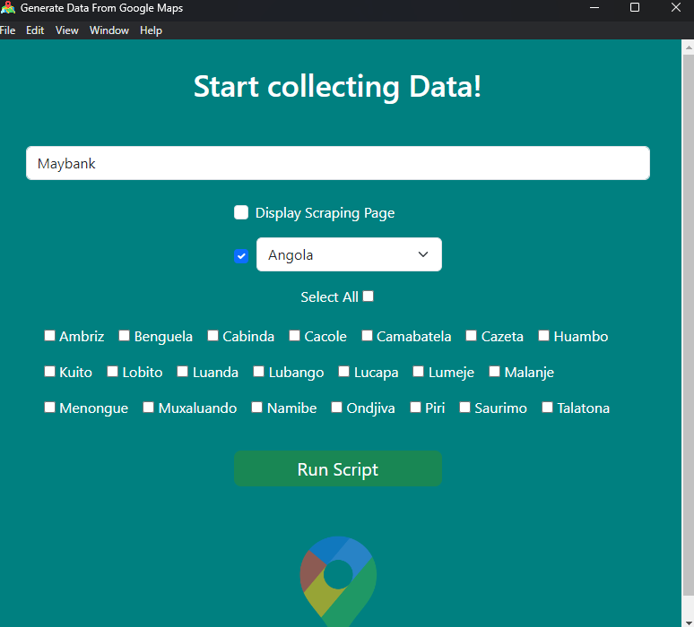
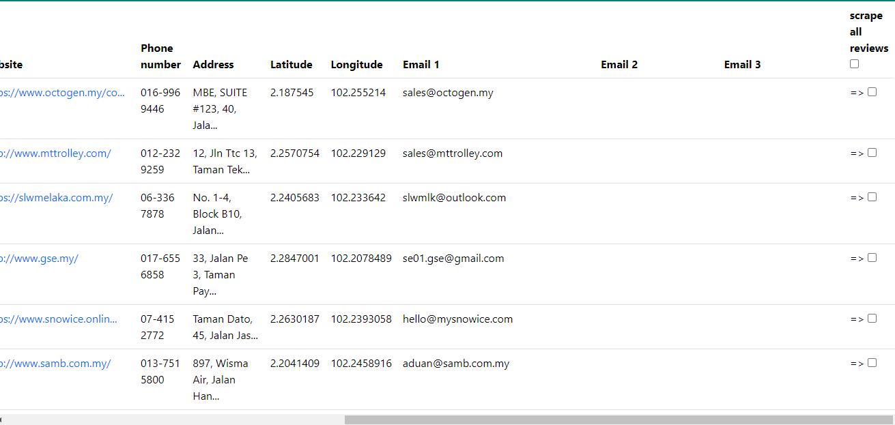
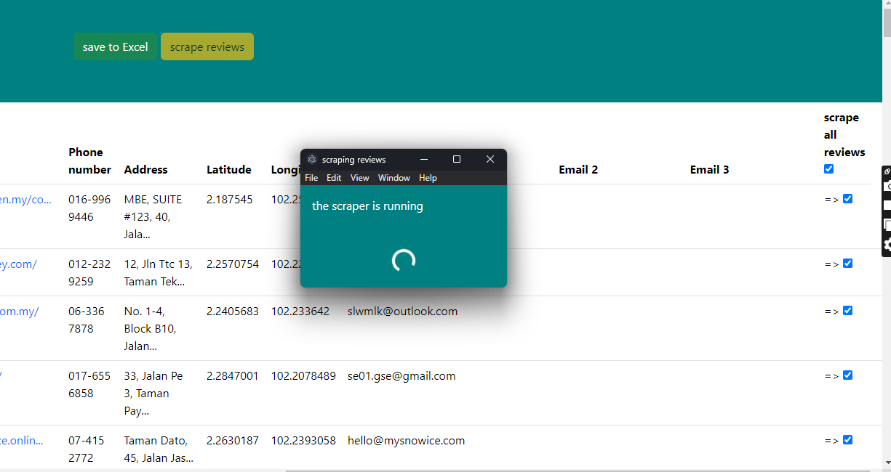
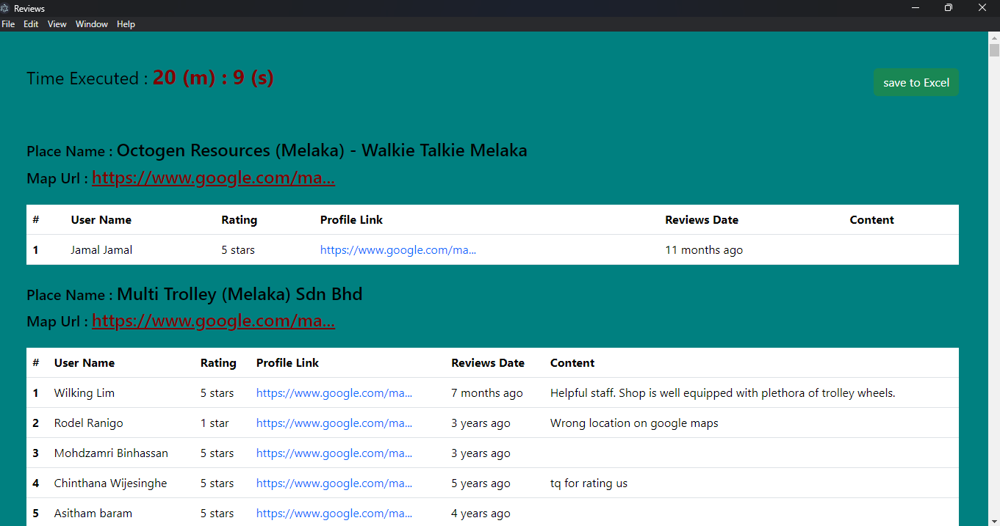

# Google Map Scrapper 
This project is a desktop application built with Electron.js for scraping data from Google Maps. It provides users with a convenient way to extract  information from Google Maps for various purposes, such as data analysis, market research, and more

## Installation

1. Clone the repository:
git clone https://github.com/mostafaElsouifi/GM_App.git

2. Install dependencies:
npm install

## App Usage 

---

**This is the main window:** user can search for specific term to lool up on google maps there is many options to chosse from : 
1. **display scraping page :** it will shows the scraping browser 
2. **select country :** if country selected it will show all cities in that country you can select all or chose some from : this help to get more resutls as per each search google maps show a maximum of 120 results 
after click the submit button the scrapper will run then the button will be disabled to prevent error until the scrapper finished process

--- 

- the scraper search and collect google maps available data .  if the place have a website it will navigate to the website and parse the home page looking for emails 

### Result :

---

- after that can sve data to excel sheet or start scrape reviews . 

---
### scrape reviews:
- after the result appear the user will have an option to scrape reviews . 
1. select all reviews to scrape
2. select some reviews 

---

### reviews result : 

<!--
## Usage

*Step 1: Perform action XYZ*

*Step 2: View result ABC* -->
